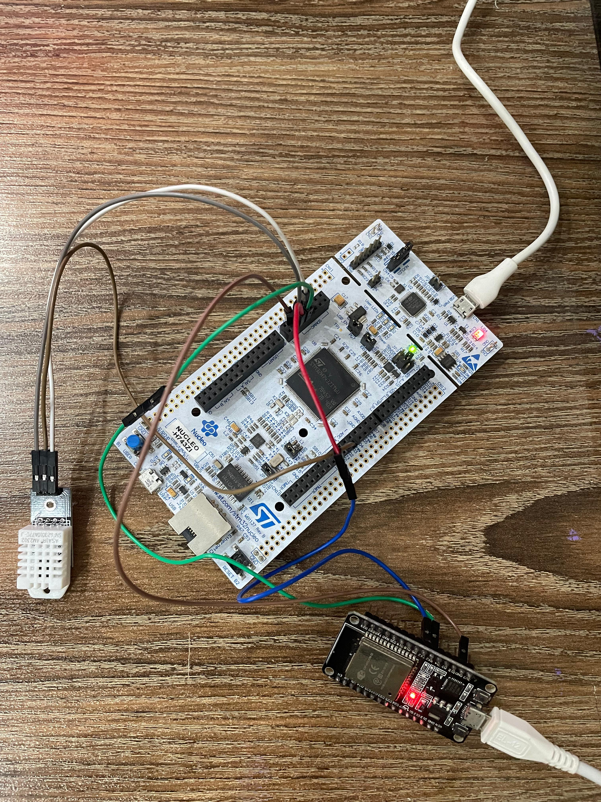

### README.md for STM32 to ESP32 Temperature and Humidity Monitoring System

#### Project Overview

This project demonstrates a system where temperature and humidity data are collected using an STM32 microcontroller from a DHT22 sensor and transmitted over UART to an ESP32. The ESP32 acts as a web server, displaying the received data on a real-time, auto-updating webpage. This allows for remote monitoring of environmental conditions. The project utilizes Visual Studio Code with the PlatformIO extension and the Arduino framework for both the STM32 and ESP32 platforms.

#### Hardware Requirements

- ESP32 DOIT DEVKIT-V1 Development Board
- STM32 Nucleo-H743Zi development board
- DHT22 Temperature and Humidity Sensor (connected to STM32)
- Connecting wires

#### Software Requirements

- Visual Studio Code
- PlatformIO IDE extension for Visual Studio Code
- Arduino framework for both STM32 and ESP32 within PlatformIO

#### External Libraries Used

- **DHT sensor library & Adafruit Unified Sensor** (for STM32): Handles reading from the DHT22 sensor.
  - Installation: Add via PlatformIO Library Manager or include `adafruit/DHT sensor library@^1.4.3` and `adafruit/Adafruit Unified Sensor@^1.1.4` in `platformio.ini`.

#### Project Structure

- **STM32_DHT22 Folder**:
  - `main.cpp`: Initializes the sensor and UART, reads data, and sends it.
  - `Sensor.h`/`Sensor.cpp`: Interfaces with the DHT22 sensor.
  - `UARTCommunication.h`/`UARTCommunication.cpp`: Manages UART transmission.
  - `Project Specific README`: You can find the project specific README inside the `STM32_DHT22` folder.

- **ESP32_DHT22 Folder**:
  - `main.cpp`: Sets up UART reception and initializes the web server.
  - `API.h`/`API.cpp`: Web server management and client request handling.
  - `UARTReceiver.h`/`UARTReceiver.cpp`: Handles parsing of UART data into usable values.
  - `Project Specific README`: You can find the project specific README inside the `ESP32_DHT22` folder.

#### Demo Video Link

- **Drive Link**: https://drive.google.com/file/d/1N2YO9eOs3JUHbfNlVGHWF6QO09DX8b5o/view?usp=drive_link

#### Hardware Setup

  